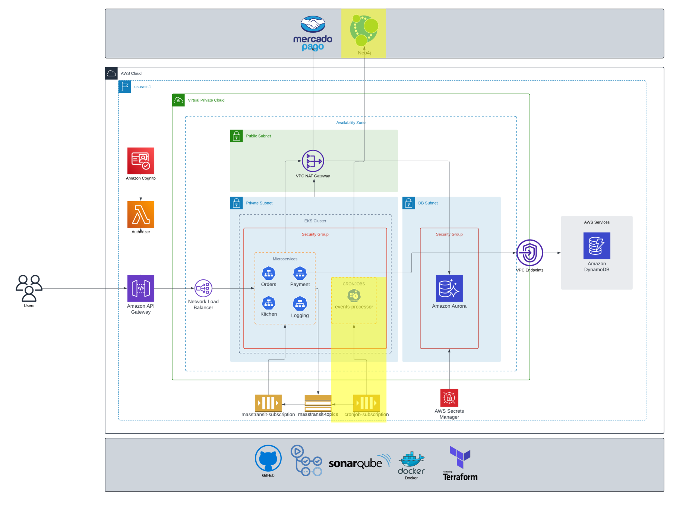

# bmb.events.processor (demo)

This application contains a cron job that processes messages from an Amazon SQS queue. The primary purpose of this application is to periodically fetch messages from the queue, process them, and handle any necessary business logic.

## Features

- **Cron Job Scheduling**: The application uses a cron job to schedule the message processing at regular intervals.
- **Amazon SQS Integration**: It integrates with Amazon SQS to fetch messages from the queue.
- **Message Processing**: Implements logic to process each message retrieved from the queue.
- **Error Handling**: Includes mechanisms to handle errors during message processing.

## Dependencies
- [API](https://github.com/soat-fiap/FIAP.TechChallenge.ByteMeBurger)

## Prerequisites

- **AWS Account**: An AWS account with access to SQS.
- **Python**: Ensure you have python installed on your machine

## Message Flow

1. **Fetch Messages**: The cron job triggers and fetches messages from the Amazon SQS queue.
2. **Process Messages**: Each message is processed according to the business logic defined in the application.
3. **Send to Graph Database**: Processed messages are sent to a graph database for later processing and analysis.

## Why Neo4j?

Using a graph database like Neo4j to store events like `CustomerRegistered` and `OrderCreated` for the fast-food ordering system can bring unique benefits, especially for tracking relationships as the system scales.

- **Real-time Recommendations and Personalization:**
    * I'm personally more interested in understanding customer relationships and order history in a way I can make highly personalized recommendations

## This repo on the infrastructure

